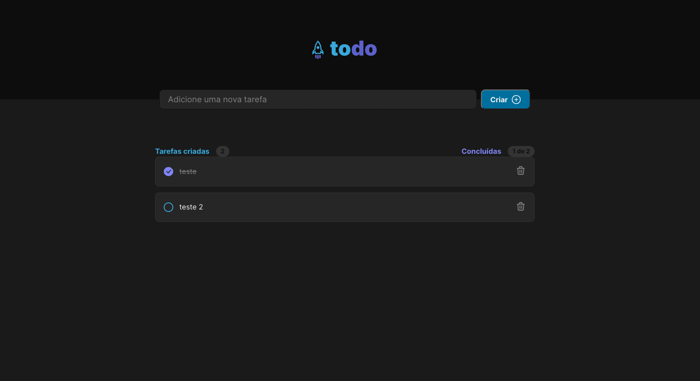
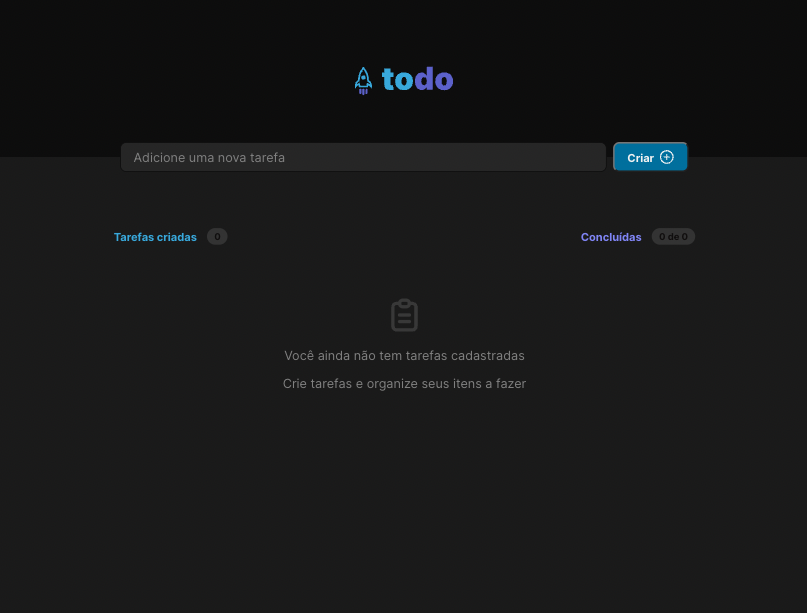

# desafio-to-do-list-reactjs

## Sobre o Desafio 🚀

Foi desenvolvido uma aplicação de controle de tarefas no estilo **to-do list**, que contém as seguintes funcionalidades:

- Adicionar uma nova tarefa
- Marcar e desmarcar uma tarefa como concluída
- Remover uma tarefa da listagem
- Mostrar o progresso de conclusão das tarefas

## Tecnologias 💻

HTML5 - CSS - ReactJS - TypeScript - Biblioteca React Icons

<!-- ## Link para visualização 🔗  -->

<!-- [Cliqui aqui - Refatorando classes ReactJS](https://refatorando-classes-reactjs.herokuapp.com/). -->

## Layout Mobile e Desktop 

     
     
    

   
 